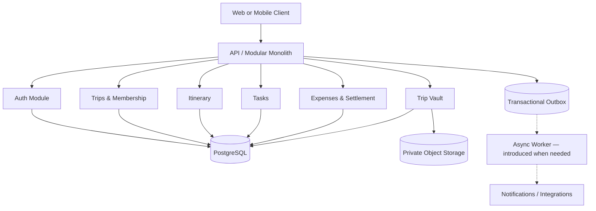

# 02 — System Architecture & Technical Design

<aside>
🏗️

**Architecture baseline:** modular monolith, PostgreSQL as the transactional source of truth, private object storage for files, and asynchronous processing introduced only when a real requirement exists. Redis is optional infrastructure, not an MVP dependency.

</aside>

## 1. Goals

- Fast MVP delivery without sacrificing boundaries.
- Strong transactional correctness for money and membership.
- Clear module ownership and dependency direction.
- Easy local development and deployment.
- Ability to scale hot paths independently later.

## 2. Proposed stack

**Client:** Next.js/React + TypeScript.

**API:** Node.js + TypeScript + NestJS (or equivalent structured HTTP framework).

**Database:** PostgreSQL.

**Cache/transient state:** None initially; Redis only when a demonstrated requirement exists.

**Async jobs:** None initially; introduce a managed queue or BullMQ + Redis when background processing is actually required.

**Files:** S3-compatible private object storage.

**Auth:** short-lived access token + refresh/session strategy; secure password hashing such as Argon2id.

**Deployment:** Dockerized application; managed PostgreSQL/Redis/object storage; CI/CD pipeline.

## 3. High-level architecture

## 4. Module boundaries

### Auth

Owns identity, credentials, sessions/refresh tokens, account lifecycle.

### Trips

Owns trip lifecycle, members, roles, invitations, membership authorization primitives.

### Itinerary

Owns activities, participant membership, ordering and schedule validation.

### Tasks

Owns responsibilities, assignment, due dates and status.

### Expenses

Owns expenses, payers, splits, settlements and balance calculation. This module has the strongest domain invariants.

### Vault

Owns metadata and authorization for trip documents; object bytes live in private object storage.

### Notifications

Consumes domain events and sends email/push/in-app notifications. It should not participate synchronously in core writes.

## 5. Dependency rules

- Modules communicate through application interfaces/domain events, not direct access to another module's repositories.
- Shared kernel should be small: IDs, time abstractions, error primitives, authorization context, money value object.
- Expense module must never depend on notification delivery for transaction success.
- File storage implementation must remain behind a storage interface.

## 6. Request lifecycle

HTTP request → authentication → authorization → input validation → application command/query → domain rules → transaction where required → response.

Every request receives a correlation/request ID.

## 7. Transaction strategy

Use PostgreSQL transactions for:

- creating an expense and all its splits;
- recording a settlement;
- accepting an invitation/join where membership uniqueness matters;
- operations that update multiple related rows whose consistency is a business invariant.

Use optimistic concurrency/version checks for collaborative mutable records where lost updates are possible.

## 8. Expense correctness model

- Store monetary values as integer minor units, never floating point.
- Store currency code on each expense.
- For MVP, each expense belongs to exactly one currency.
- Sum of payer contributions must equal expense total.
- Sum of participant shares must equal expense total.
- Only active/eligible trip members may be included unless product rules explicitly permit otherwise.
- Settlement records must reference real member identities and cannot exceed outstanding debt without an explicit overpayment/refund model.

## 9. Events and outbox

Core transaction writes an outbox event in the same PostgreSQL transaction when reliable asynchronous processing is required. The outbox is persisted in PostgreSQL; its delivery mechanism is deliberately deferred until async workloads justify a worker/queue.

Examples:

- `TripCreated`
- `MemberJoinedTrip`
- `ActivityCreated`
- `TaskAssigned`
- `ExpenseCreated`
- `SettlementRecorded`

Consumers must be idempotent because delivery can be retried.

## 10. Security architecture

- Argon2id password hashing.
- Secure token/session rotation and revocation strategy.
- Role-based trip authorization.
- Object storage private by default.
- Signed URLs or server-authorized downloads with short expiry.
- Rate limits on authentication, invitations and public token endpoints.
- Validate uploaded file type, size, extension, and content handling policy.
- Avoid sensitive values in logs.
- CSRF protection where cookie-based auth is used.

## 11. Observability

**Logs:** structured JSON, request ID, user/trip identifiers only where appropriate.

**Metrics:** request latency/error rate, DB latency, queue depth, job failures, expense write failures, auth failures, invitation acceptance, storage errors.

**Tracing:** add distributed tracing once async integrations or service extraction becomes significant.

**Alerts:** elevated 5xx, database failures, queue backlog, failed critical jobs, unusual auth failure rate.

## 12. Scaling path

Stage 1: single API deployment + managed PostgreSQL/Redis/storage.

Stage 2: horizontal API replicas; connection pool tuning; cache selected read-heavy endpoints.

Stage 3: dedicated workers; queue partitioning; read replicas if measured need exists.

Stage 4: extract only proven hotspots (e.g. notifications or search) into services.

Do not introduce microservices solely for resume value.

## 13. Deployment environments

- Local: Docker Compose.
- CI: lint, typecheck, unit tests, integration tests, migration verification.
- Staging: production-like infrastructure with synthetic/test data.
- Production: managed DB, private storage, secrets manager, backups, monitoring.

## 14. Disaster recovery

- Automated PostgreSQL backups.
- Point-in-time recovery where supported.
- Object-storage versioning/lifecycle policy.
- Migration rollback strategy for safe changes.
- Document restore procedure and recovery objectives before production.

## 15. Architecture exit criteria

Before considering service extraction, demonstrate a measurable bottleneck, a clear ownership boundary, independent scaling/deployment benefit, and an operational plan for retries, observability, and data ownership.