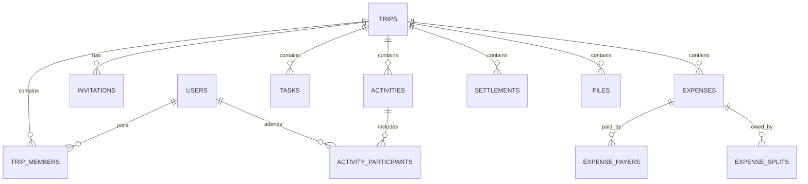

# 03 — Data Model & API Specification

<aside>
🗄️

**Contract document:** database ownership, invariants, authorization and HTTP API conventions. Treat breaking changes as deliberate decisions.

</aside>

## 1. Core entities

### users

`id`, `name`, `email`, `password_hash` (nullable when no local password is configured), `created_at`, `updated_at`, `status`.

### auth_identities

`id`, `user_id`, `provider`, `provider_user_id`, `email_at_provider`, timestamps. Unique `(provider, provider_user_id)`.

Supported MVP providers:

- `password` for local email/password credentials.
- `google` for Google Sign-In.
- `apple` for Apple Sign-In.
- `facebook` for Facebook Login.

A user may have multiple authentication identities linked to one TripOS account. Provider identity is not itself the TripOS user identity.

### trips

`id`, `name`, `destination`, `start_date`, `end_date`, `created_by`, `status`, timestamps.

### trip_members

`trip_id`, `user_id`, `role`, `status`, `joined_at`, timestamps. Unique `(trip_id, user_id)`.

### invitations

`id`, `trip_id`, `invited_by`, `token_hash`, `expires_at`, `accepted_by`, `accepted_at`, `status`, timestamps. Never store a reusable raw invitation token.

### activities

`id`, `trip_id`, `title`, `description`, `location`, `start_at`, `end_at`, `estimated_amount_minor`, `currency`, `created_by`, `updated_at`, `version`.

### activity_participants

`activity_id`, `user_id`. Unique composite key.

### tasks

`id`, `trip_id`, `title`, `description`, `assigned_to`, `due_at`, `status`, `created_by`, timestamps, `version`.

### expenses

`id`, `trip_id`, `description`, `category`, `amount_minor`, `currency`, `expense_date`, `created_by`, timestamps, `version`.

### expense_payers

`expense_id`, `user_id`, `amount_minor`. Composite uniqueness. Sum must equal expense amount.

### expense_splits

`expense_id`, `user_id`, `amount_minor`. Composite uniqueness. Sum must equal expense amount.

### settlements

`id`, `trip_id`, `from_user_id`, `to_user_id`, `amount_minor`, `currency`, `settled_at`, `created_by`, `reference`, timestamps.

### files

`id`, `trip_id`, `uploaded_by`, `object_key`, `original_name`, `content_type`, `size_bytes`, `checksum`, timestamps. Bytes remain outside PostgreSQL.

### outbox_events

`id`, `aggregate_type`, `aggregate_id`, `event_type`, `payload`, `created_at`, `published_at`, `attempt_count`.

## 2. Relationships



## 3. Money rules

All amounts use integer minor units: INR ₹100.50 is `10050` paise. The API may accept decimal user input but must normalize before persistence.

For every expense:

`sum(expense_payers.amount_minor) = expenses.amount_minor`

`sum(expense_splits.amount_minor) = expenses.amount_minor`

Balances are derived from contributions minus obligations minus recorded settlements. Never treat a cached balance as the accounting source of truth.

## 4. Authorization matrix

| Operation | Owner | Admin | Member |
| --- | --- | --- | --- |
| Read trip | Yes | Yes | Yes |
| Edit trip settings | Yes | Yes | No |
| Manage membership | Yes | Yes | Limited |
| Add activity | Yes | Yes | Yes |
| Edit own activity | Yes | Yes | Yes |
| Add expense | Yes | Yes | Yes |
| Edit expense | Yes | Yes | Restricted |
| Record settlement | Yes | Yes | Yes |
| Manage tasks | Yes | Yes | Yes |
| Upload trip file | Yes | Yes | Yes |
| Archive trip | Yes | No | No |

Authorization is enforced server-side even when UI hides actions.

## 5. API conventions

- Base path: `/api/v1`.
- JSON request/response bodies.
- UUID identifiers.
- ISO-8601 timestamps in UTC.
- Cursor pagination for potentially large collections.
- Consistent error envelope: `code`, `message`, `details`, `request_id`.
- Validation errors identify fields without leaking internals.
- Idempotency key required for money-creating commands where duplicate submission is plausible.

## 6. Authentication endpoints

`POST /auth/register`

`POST /auth/login`

`GET /auth/{provider}` — start Google/Apple/Facebook authentication flow.

`GET /auth/{provider}/callback` — provider callback handled by the backend.

`POST /auth/link/{provider}` — authenticated account-linking flow where supported.

`DELETE /auth/identities/{identityId}` — unlink an authentication method subject to account-safety rules.

`POST /auth/logout`

`GET /me`

### Social login flow

1. User selects Google, Apple, or Facebook.
2. Backend starts the provider's OAuth/OIDC authorization flow.
3. Provider authenticates the user and redirects back to TripOS.
4. Backend validates the authorization response and provider identity.
5. TripOS resolves `(provider, provider_user_id)` to an existing `auth_identity`.
6. If no identity exists, TripOS applies explicit account-linking/creation rules rather than blindly creating a duplicate user.
7. A secure TripOS session is established.
8. User is redirected into the application.

Never trust a provider-supplied email alone as the sole identity key. Provider subject/user ID is authoritative for the provider identity.

### Account linking rules

- Multiple providers may map to one TripOS `user_id`.
- Linking a provider must require an authenticated TripOS session or an explicit safe account-recovery flow.
- If the provider identity is already linked to another TripOS account, reject the link rather than merging accounts automatically.
- Account merging, if ever supported, must be an explicit, security-reviewed flow.
- Users must not be allowed to remove their last usable authentication method without adding/reconfirming another method.
- Apple private relay emails must not be assumed to be the user's permanent primary email identity.

## 7. Trip endpoints

`POST /trips`

`GET /trips`

`GET /trips/{tripId}`

`PATCH /trips/{tripId}`

`POST /trips/{tripId}/archive`

`POST /trips/{tripId}/invitations`

`GET /trips/{tripId}/members`

`PATCH /trips/{tripId}/members/{userId}`

`DELETE /trips/{tripId}/members/{userId}`

`POST /invitations/{token}/accept`

## 8. Itinerary endpoints

`POST /trips/{tripId}/activities`

`GET /trips/{tripId}/activities?from=&to=`

`GET /activities/{activityId}`

`PATCH /activities/{activityId}`

`DELETE /activities/{activityId}`

`PUT /activities/{activityId}/participants`

## 9. Task endpoints

`POST /trips/{tripId}/tasks`

`GET /trips/{tripId}/tasks`

`PATCH /tasks/{taskId}`

`DELETE /tasks/{taskId}`

## 10. Expense endpoints

`POST /trips/{tripId}/expenses`

`GET /trips/{tripId}/expenses`

`GET /expenses/{expenseId}`

`PATCH /expenses/{expenseId}`

`DELETE /expenses/{expenseId}` — soft delete/void according to financial policy.

`GET /trips/{tripId}/balances`

`GET /trips/{tripId}/settlements`

`POST /trips/{tripId}/settlements`

## 11. Example expense command

```json
{
  "description": "Dinner",
  "amount": 2400,
  "currency": "INR",
  "paidBy": [{"userId": "uuid-rahul", "amount": 2400}],
  "split": [
    {"userId": "uuid-sidhant", "amount": 800},
    {"userId": "uuid-rahul", "amount": 800},
    {"userId": "uuid-aman", "amount": 800}
  ]
}
```

Server converts `amount` to minor units and rejects any payer/split mismatch.

## 12. Settlement algorithm

1. Calculate each member's net balance.
2. Separate creditors and debtors.
3. Match debtor amounts against creditor amounts.
4. Emit a deterministic set of suggested transfers.
5. Suggestions are not accounting records until a user records an actual settlement.

## 13. Concurrency

Use a `version` field or conditional update for collaborative records. Money commands execute in transactions and use idempotency keys to prevent duplicate writes caused by retries.

## 14. Indexing baseline

- `trip_members(trip_id, user_id)` unique.
- `activities(trip_id, start_at)`.
- `tasks(trip_id, status, due_at)`.
- `expenses(trip_id, expense_date)`.
- `expense_splits(expense_id, user_id)`.
- `settlements(trip_id, settled_at)`.
- `outbox_events(published_at, created_at)`.

Add indexes only where query patterns justify them; inspect query plans for slow paths.