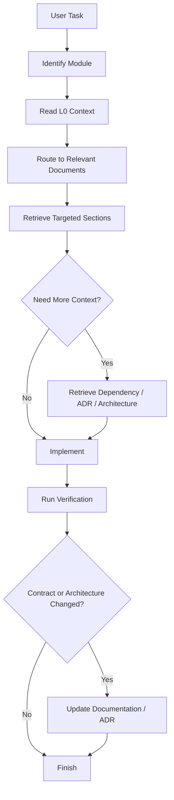

# 08 — AI Development & Token Optimization Protocol

<aside>
🎯

Purpose: Make TripOS easy for AI coding assistants and agents to implement correctly while minimizing unnecessary context, token usage, repeated explanations, and cross-document confusion.

</aside>

# 1. Document Purpose

This document defines how AI models and coding agents should consume TripOS project documentation during development.

The goal is **not** to force an AI to remember the entire project. The goal is to create a predictable context-loading system where an AI retrieves only the information required for the current task.

This protocol is model-agnostic and should work with ChatGPT, Claude, Gemini, Cursor, GitHub Copilot, local coding agents, and future autonomous development agents.

## Core principle

> **Load the minimum sufficient context required to make a correct decision or implementation.**
> 

Avoid loading the entire documentation set for every task.

# 2. Why Token Optimization Is Necessary

TripOS documentation will grow as the product evolves. If every implementation task requires reading every PRD, architecture document, API specification, ADR, risk register, and roadmap, context usage will grow unnecessarily.

This creates several problems:

- Higher token consumption.
- Slower AI responses.
- More irrelevant information in context.
- Increased chance of conflicting requirements being mixed together.
- Less attention available for the actual implementation.
- Repeated explanations across sessions.
- Difficulty handing work between different AI agents.

Therefore, TripOS documentation must behave like a **retrievable knowledge base**, not like one giant prompt.

# 3. Documentation Context Hierarchy

Use four context levels.

## L0 — Always Required

Load only the minimum project orientation:

- This AI Development & Token Optimization Protocol.
- Project Context Index contained in this document.
- The user's current task/request.
- Current implementation status when available.

L0 answers: **What is TripOS and where should I look?**

## L1 — Task-Relevant Specification

Load the documents or sections directly related to the current module:

- Product Requirements Document.
- Data Model & API Specification.
- Relevant implementation phase.

L1 answers: **What exactly are we building?**

## L2 — Supporting Engineering Context

Load only when the task requires deeper engineering decisions:

- System Architecture & Technical Design.
- Technical Decision Log / ADRs.
- Engineering Challenges & Risk Register.
- Security, observability, deployment, or scalability guidance.

L2 answers: **How should it be built safely and consistently?**

## L3 — Optional / Explicitly Requested

Only load when needed:

- Future Features & Product Extensions.
- Historical decisions.
- Unrelated modules.
- Entire project documentation.
- Previous implementation conversations.

L3 should **never be loaded by default**.

# 4. TripOS Project Context Index

Use this index to route a task to the smallest useful set of documents.

| Task / Module | First Context | Add If Needed |
| --- | --- | --- |
| Authentication | Data/API + Architecture | Security/ADR |
| User profile | PRD + Data/API | Architecture |
| Trip creation | PRD + Data/API | Architecture |
| Trip members | PRD + Data/API | ADR/Security |
| Invitations | PRD + Data/API | Security/Notifications |
| Itinerary | PRD + Data/API | Architecture |
| Expenses | Data/API + PRD | ADR + Architecture |
| Expense splits | Data/API | Expense ADR + tests |
| Balances | Data/API | Expense ADR |
| Settlements | Data/API | Expense ADR |
| Tasks | PRD + Data/API | Notifications |
| Trip vault | PRD + Data/API | Security + storage architecture |
| Notifications | Architecture + Data/API | ADR |
| Background jobs | Architecture | ADR + observability |
| Caching | Architecture | Performance ADR |
| Database optimization | Data/API + Architecture | Risk/ADR |
| API design | Data/API | Architecture + ADR |
| Security | Architecture + Data/API | Security decisions |
| Testing | Implementation phase + API/Data | Architecture |
| Deployment | Architecture | Risk/ADR |
| Scaling | Architecture | Risk/ADR |
| AI features | Future Features + Architecture | Product/AI ADR |
| Debugging | Relevant module docs | Architecture + logs/tests |
| Refactoring | Current module docs | ADR + architecture |

# 5. Document Responsibility Map

Each document has one primary purpose. AI agents should avoid using one document as a substitute for another.

### 01 — Product Requirements Document

Source of truth for:

- Product goals.
- User problems.
- MVP scope.
- User stories.
- Functional requirements.
- Product acceptance criteria.

### 02 — System Architecture & Technical Design

Source of truth for:

- Architecture.
- Components.
- Service/module boundaries.
- Data flow.
- Infrastructure.
- Scalability.
- Reliability.
- Security architecture.

### 03 — Data Model & API Specification

Source of truth for:

- Entities.
- Relationships.
- Database rules.
- API contracts.
- Request/response structures.
- Validation expectations.

### 04 — Phase-wise Implementation Plan

Source of truth for:

- What should be implemented next.
- Dependency order.
- Milestones.
- Phase completion criteria.

### 05 — Engineering Challenges & Risk Register

Source of truth for:

- Known technical risks.
- Failure modes.
- Difficult engineering areas.
- Mitigation strategies.

### 06 — Future Features & Product Extensions

Source of truth for:

- Post-MVP ideas.
- Long-term capabilities.
- AI features.
- Product evolution.

Do not use this document to justify adding future functionality to an MVP task unless explicitly requested.

### 07 — Technical Decision Log

Source of truth for:

- Important architectural decisions.
- Alternatives considered.
- Reasons for decisions.
- Consequences and trade-offs.

### 08 — AI Development & Token Optimization Protocol

Source of truth for:

- How AI should navigate the documentation.
- Context-loading rules.
- Token optimization.
- Agent workflow.
- Session handoff.
- Documentation synchronization.

# 6. AI Task Execution Protocol

Every implementation request should follow this sequence.

## Step 1 — Understand the task

Extract:

- Requested feature/fix.
- Affected module.
- Expected behavior.
- Constraints.
- Explicit non-goals.

Do not start by reading all project documentation.

## Step 2 — Route the task

Identify the affected TripOS module and use the Context Index to select the minimum relevant documents.

## Step 3 — Retrieve targeted context

Read the relevant sections rather than entire documents whenever the retrieval system supports section-level access.

Prioritize:

1. Requirement.
2. Contract.
3. Data model.
4. Applicable architecture.
5. Applicable ADRs.
6. Tests/acceptance criteria.

## Step 4 — Check dependencies

Before implementation, determine whether the task depends on:

- Existing entities.
- Existing API contracts.
- Authentication/authorization.
- Transactions.
- Events/jobs.
- Notifications.
- External integrations.

Only retrieve additional context for identified dependencies.

## Step 5 — Check decisions

Search the Technical Decision Log for decisions affecting the implementation.

An existing ADR should be followed unless the task explicitly requires changing that decision.

## Step 6 — Implement

Implement the smallest correct change consistent with the documented architecture.

Do not introduce speculative future features.

## Step 7 — Verify

Run the appropriate verification:

- Unit tests.
- Integration tests.
- API tests.
- Type checking.
- Linting.
- Database migration validation.
- Relevant manual checks.

## Step 8 — Update documentation only when necessary

Update documentation when implementation changes:

- API contracts.
- Data models.
- Architecture.
- Security behavior.
- Important technical decisions.
- Implementation phase status.

Do not rewrite documentation after every small code change.

# 7. Context Loading Rules

## Rule 1 — Never read everything by default

An agent must not load all TripOS documents simply because they exist.

## Rule 2 — Prefer targeted retrieval

Retrieve the smallest section that answers the current question.

## Rule 3 — Follow dependencies, not curiosity

If the task concerns expenses, do not load the entire itinerary specification unless the expense implementation actually depends on itinerary behavior.

## Rule 4 — Prefer source-of-truth documents

If the same information appears in multiple places, prefer the designated source-of-truth document.

## Rule 5 — Do not duplicate context

Do not repeatedly paste the same architecture, schema, or requirements into every agent prompt.

## Rule 6 — Use summaries for orientation

Use compact summaries to navigate the project, then retrieve detailed sections only when needed.

## Rule 7 — Keep implementation context temporary

Once a feature is complete, its detailed implementation context does not need to remain in every future session.

# 8. Token Budget Strategy

Treat context as a limited engineering resource.

A practical strategy is:

- **Small task:** current task + L0 + one relevant specification.
- **Normal feature:** L0 + relevant PRD + Data/API + implementation phase.
- **Complex feature:** above + relevant architecture + ADRs.
- **Architecture change:** L0 + relevant architecture + Data/API + ADR history + risks.
- **Whole-project review:** explicitly request L3/global context.

The exact token limits should remain model-specific. The protocol should control **what** is loaded rather than hard-code one token number for every model.

# 9. Context Compression

When context becomes large, compress it into structured information instead of carrying raw conversation history.

Use this format:

### Implementation Context

**Task:**

Short description.

**Current state:**

What already exists.

**Decision:**

What has been decided.

**Changes made:**

Files/modules/APIs/database changes.

**Open issues:**

Known unresolved problems.

**Next action:**

The next concrete step.

**Relevant documents:**

Only the document names/sections required to continue.

This summary becomes the handoff context for the next session or agent.

# 10. Session Handoff Protocol

When an AI session ends before the project is complete, create a compact handoff rather than copying the entire conversation.

The handoff must contain:

1. Goal.
2. Current implementation state.
3. Completed work.
4. Files/modules affected.
5. Decisions made.
6. Tests run.
7. Known failures.
8. Remaining work.
9. Relevant documentation references.

The next agent should load the handoff plus only the documents relevant to the next action.

# 11. Handling Conflicting Documentation

When two documents appear to disagree, AI must not silently choose one.

Use this precedence order:

1. Explicit current user requirement.
2. Approved technical decision / ADR.
3. Current API/data contract.
4. Current architecture.
5. Product requirements.
6. Implementation plan.
7. Future roadmap.
8. Historical discussion.

If the conflict affects architecture or a public contract, flag it and propose a documentation update.

# 12. ADR Protocol

Create or update an ADR when a decision has meaningful long-term consequences.

Examples:

- Changing database technology.
- Introducing a new infrastructure component.
- Changing authentication architecture.
- Changing expense calculation strategy.
- Introducing asynchronous processing.
- Changing module boundaries.
- Introducing a major external dependency.

Do not create ADRs for trivial implementation details.

An ADR should capture:

- Context.
- Problem.
- Options considered.
- Decision.
- Why it was selected.
- Consequences.

# 13. Coding Agent Rules

AI coding agents working on TripOS should follow these rules:

- Inspect the existing code before proposing replacements.
- Preserve established conventions unless there is a reason to change them.
- Do not create duplicate modules/entities/services.
- Do not change public contracts casually.
- Do not add dependencies without justification.
- Prefer incremental changes.
- Keep migrations explicit and reviewable.
- Never assume undocumented business rules.
- Ask for clarification when ambiguity materially affects architecture or user behavior.
- Verify behavior after implementation.

# 14. Backend Implementation Context Pattern

For a backend task such as **“implement expense creation”**, the agent should normally load:

**L0**

- This protocol.
- Current task.

**L1**

- Expense-related Data/API sections.
- Expense requirements.
- Current implementation phase.

**L2 only if needed**

- Architecture transaction guidance.
- Expense-related ADR.
- Relevant risks.

The agent does **not** need the complete itinerary, task, vault, roadmap, or unrelated product documentation.

# 15. Frontend Implementation Context Pattern

For **“build the trip expense screen”**:

Load:

- Expense product requirements.
- Expense API contract.
- Relevant data structures.
- Current frontend architecture/conventions.

Only load broader architecture if the UI introduces a new application-level pattern.

# 16. Database Change Context Pattern

For **“add settlement status to expenses”**:

Load:

- Current data model.
- API impact.
- Expense ADRs.
- Relevant architecture constraints.

Then determine:

- Migration requirements.
- Backward compatibility.
- Existing data handling.
- API versioning implications.
- Tests required.

# 17. Debugging Context Pattern

For a production bug:

1. Read the bug report/log/error.
2. Identify affected module.
3. Retrieve the relevant API/data/architecture section.
4. Inspect the implementation.
5. Reproduce if possible.
6. Fix the smallest root cause.
7. Add regression coverage.
8. Update documentation only if the bug reveals an undocumented design rule.

Do not load the complete project context unless the evidence indicates a cross-module problem.

# 18. AI-Assisted Development Loop



# 19. What AI Must NOT Do

AI agents must not:

- Read every document for every task.
- Treat the future roadmap as current requirements.
- Treat old conversation messages as stronger than current source-of-truth documents.
- Invent undocumented business rules.
- Make architectural changes without checking ADRs.
- Duplicate existing APIs or entities.
- Persist derived expense balances as authoritative state without an explicit decision.
- Introduce microservices simply because the product may scale in the future.
- Expand an MVP task into unrelated future features.
- Rewrite large parts of the system when a focused change is sufficient.

# 20. Documentation Maintenance Rules

Documentation should evolve with the system but should remain compact.

Update a document when its source-of-truth information changes.

Examples:

- New endpoint → update Data/API Specification.
- Schema change → update Data Model.
- Architecture boundary change → update Architecture document.
- Important design choice → update Technical Decision Log.
- New implementation milestone → update Implementation Plan.
- New major risk → update Risk Register.
- New long-term capability → update Future Features.

Avoid copying the same information into multiple documents.

# 21. Recommended AI Prompt Envelope

When starting an implementation task, an agent can use this compact instruction pattern:

```
You are working on TripOS.

Follow the TripOS AI Development & Token Optimization Protocol.

Task:
[task]

First identify the affected module and retrieve only the minimum relevant project context.
Use source-of-truth documents and applicable ADRs.
Do not load unrelated documentation.
Inspect the existing implementation before changing it.
Implement incrementally and verify the result.
If requirements conflict, stop and surface the conflict rather than guessing.
```

This prompt is intentionally short. The detailed knowledge should live in the project documentation, not inside the prompt.

# 22. Future Agent Architecture

As TripOS development becomes more AI-assisted, the documentation system can evolve into an agent-readable knowledge architecture.

Potential future components:

- Project context index.
- Semantic document search.
- Section-level retrieval.
- Code-to-document linking.
- API contract retrieval.
- ADR retrieval.
- Automated implementation summaries.
- Test-result summaries.
- Git diff → documentation impact detection.
- Automatic stale-document detection.
- Agent session handoffs.
- Repository-aware coding agents.

The principle remains the same: **retrieve relevant knowledge just in time rather than injecting the entire project into every context window.**

# 23. Success Criteria

This protocol is successful if an AI agent can:

- Understand TripOS without reading every document.
- Identify which documents matter for a task.
- Implement features consistently with the architecture.
- Avoid unrelated context.
- Respect existing technical decisions.
- Produce compact session handoffs.
- Update source-of-truth documentation when required.
- Work effectively across multiple AI models or agents.
- Reduce repeated project explanations over time.

# 24. Final Operating Principle

<aside>
🧠

**TripOS documentation is a knowledge base, not a giant prompt.** AI should navigate it, retrieve what it needs, implement against the source of truth, verify the result, and leave behind a compact handoff for the next agent.

</aside>

This protocol should be considered part of the engineering system itself. As the codebase and documentation grow, improve the retrieval and routing strategy rather than simply adding more information to every AI prompt.